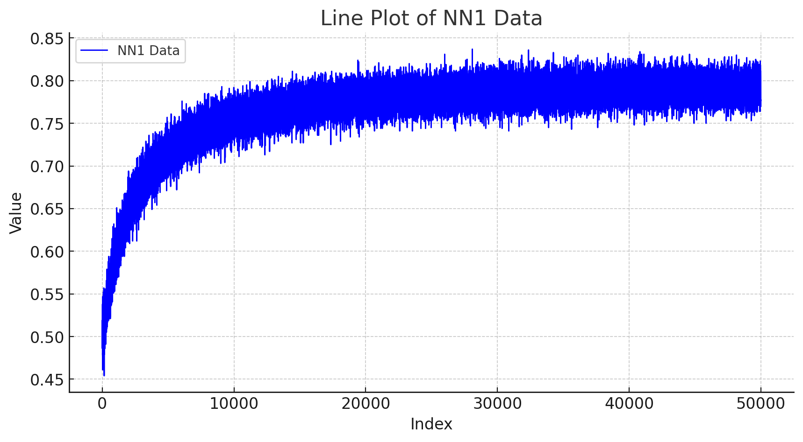

# Experiments on the IMDb dataset

Stochastic Rising Bandits are a powerful tool to model a lot of real-world-challlenges. In particular we focus on concave rising rested bandits, that are incredibly fitting to describe Recommendation system, in which you should be able to model satiation effects ([a](https://papers.ssrn.com/sol3/papers.cfm?abstract_id=4640583), [b](https://arxiv.org/abs/2302.08345)). In particular in this scenario, Bandits algorithms serves as meta-algorithms. In fact, we will consider the algorithms (such as, logistic regression, neural networks and OGD) as different arms, and the expected reward will be based on the score ogiven by IMDb. More in detail:

• the agent decides to pull arm $I_t$;

• a random point $x_t$ of the IMDB dataset is selected and supplied to the classification algorithm associated to arm $It$;

• the “base” algorithm classifies the sample, i.e., it provides the prediction $\hat{y}_{t}$ for the score of the selected sample $x_t$;

• the environment generates the reward comparing the prediction $\hat{y}_t$ to the target class $y_t$ using the following function
$R_t=1-|y_t-\hat{y}_t|$;
• the base algorithm is updated using ${x_t,y_t}$; 

Since the base algorithms are trained only if their arm is selected, this is a problem which belongs to the rested scenario.
For the classification task we decided to employ:

• Online Logistic Regression (LR) methods with different schemes used for the learning rate $\lambda_t$;

• Neural Networks (NNs) different in terms of shape and number of neurons
Specifically, we adopt a decreasing scheme for the learning rate of $\lambda_t=\beta_t/t$ and a constant learning rate (denoted as LR from now on). Moreover, the NNs use as activation functions the rectified linear unit, i.e., $relu(x)=max{0,x}$, a constant learning rate $\alpha=0.001$ and the “adam” stochastic gradient optimizer for fitting. Two of the chosen nets have only one hidden layer, with 1 and 2 neurons, respectively, the third net has 2 hidden layer, with 2 neurons each, and two nets have 3 layers with 2,2,2 and 1,1,2 neurons, respectively. We refer to a specific NN denoting in curve brackets the cardinalities of the layers, e.g., the one having 2 layer with 2 neurons each is denoted by NN22. We analyzed their global performance on the IMDB dataset by averaging 1,000 independent runs in which each strategy is
sequentially fed with all the available 50,000 samples. The data were available in the publicc gits ([repo1](https://github.com/albertometelli/stochastic-rising-bandits/tree/main/data/learning%20curves/npy), [repo 2](https://github.com/MontenegroAlessandro/BestArmIdSRB/tree/main/environment/imdb)). An example of a (noisy) learning curve is given by:

Then, all these learning curves were fitted to the curve $f(n)=a+b(1-e^{-cn})$, and were put in the model section as a Lambda function in zip file we have provided in the upload. We run all the algorithms against we are competing 20 times and the results for each run is provided in the section experiments. For the final version of the paper we will provide a more polished version of the results.
